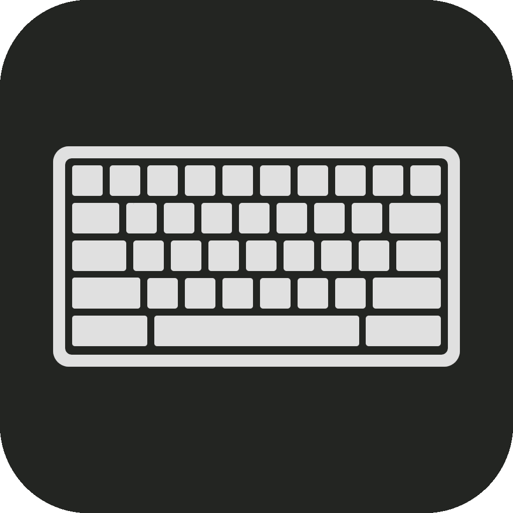

# Desktop Keyboard

**Desktop Keyboard** is a simple on screen keyboard that automatically hides and unhides during input events.

## Getting Started
### Installation
1. Download it [here](https://github.com/serifpersia/DesktopKeyboard/releases).
3. Extract the contents of the zip and run `setup.exe` to install Desktop Keyboard on your system.

### Usage
- Run it and interact with input elements on windows system or applications

## Building from Source
To build Desktop Keyboard yourself, ensure you have the following installed:
- **Visual Studio 2022** (or newer).
- **.NET 9.0 SDK** (or newer).
- **Microsoft Visual Studio Installer Projects** extension installed in Visual Studio.

### Steps:
1. Clone the repository.
2. Open `DesktopKeyboard.slnx` in Visual Studio.
5. Build the `DesktopKeyboard` project, then build the `desktop_keyboard_setup` project to generate the installer.

## Requirements
- Windows 10 or Windows 11 (x64 architecture).
- .NET 9.0 Runtime (included automatically if using the installer).

## License
This project is licensed under the **MIT License**. See the [LICENSE](LICENSE) file for details.
  
